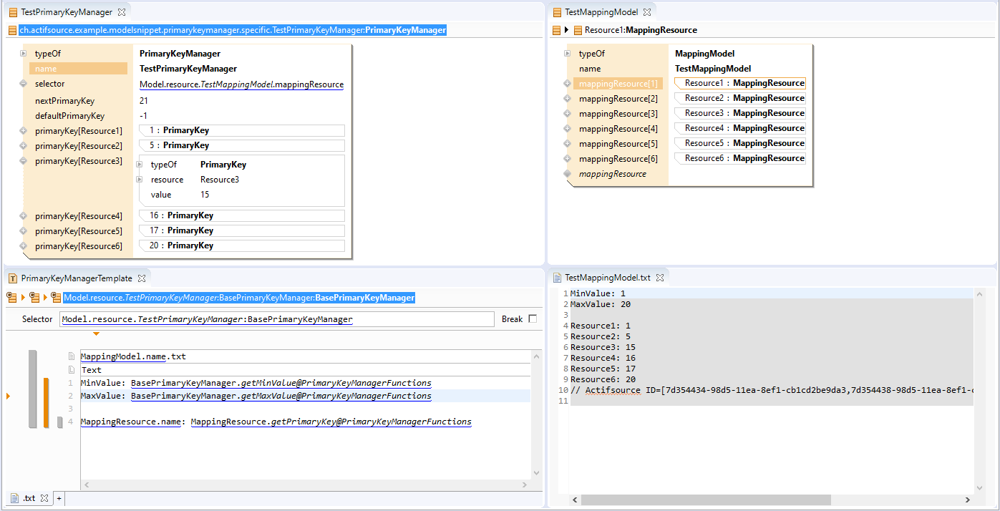
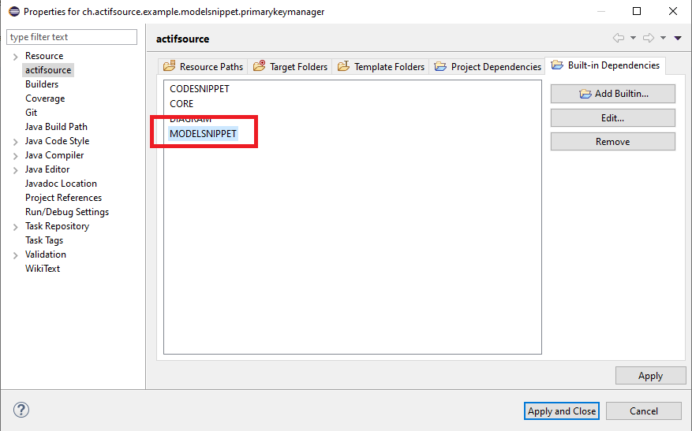

# Primary Key Manager
In this project we will show how to define a unique id for any resource.

## Model Snippet Built-In
Define the model snippet built-in

## Requirements
Actifsource Workbench Enterprise Edition
